<div align="center">

<picture>
  <source media="(prefers-color-scheme: dark)" srcset="public/hero-dark.svg">
  
</picture>

<br>
<br>

### The first accurate real-time visualization of a full-scale LLM forward pass.

[](https://doi.org/10.5281/zenodo.20505470)

3.8 billion parameters. Your GPU. Your browser. Every tensor rendered 1:1.<br>
No server. No API key. No fakery.

<br>

[](LICENSE)
[](https://huggingface.co/microsoft/Phi-3-mini-4k-instruct)
[](https://www.w3.org/TR/webgpu/)
[](#validation)
[](https://github.com/abgnydn/neuropulse/stargazers)

<br>

[**Launch Demo**](https://neuropulse.live/app/) &nbsp;·&nbsp; [**Read the Essay**](https://neuropulse.live/) &nbsp;·&nbsp; [**Methods**](METHODS.md) &nbsp;·&nbsp; [**Predictions**](PREDICTIONS.md) &nbsp;·&nbsp; [**Standards**](RESEARCH_STANDARDS.md)

<br>

</div>

<div align="center">

<picture>
  <source media="(prefers-color-scheme: dark)" srcset="public/stats-dark.svg">
  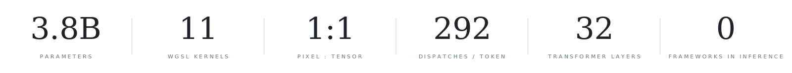
</picture>

</div>

<br>

> [!NOTE]
> **Strict 1:1.** Every mark on screen is a function of a real GPU tensor. The brightness of each point **is** the activation value. The lines between attention heads **are** the real attention weights. The token probabilities rolling across the screen **are** the actual logits from the final layer.

<br>

<div align="center">

<picture>
  <source media="(prefers-color-scheme: dark)" srcset="public/preview-dark.svg">
  
</picture>

<sub>A stylized snapshot of the live in-browser visualizer. Open <a href="https://neuropulse.live/app/">neuropulse.live/app/</a> to drive your own.</sub>

</div>

<br>

## The problem

Every "AI visualization" you've seen online is **decoration**.

Animated dots pulsing to a fake rhythm. Particle systems that aren't connected to anything real. A beautiful metaphor with no model behind the curtain. You walk away thinking you saw how an LLM works. You didn't — you saw how a designer *imagines* it works.

Neuropulse is the opposite. Type a prompt. Watch 3.8 billion parameters process it. Every value on screen is read straight from a live GPU tensor — not interpolated, not pre-baked, not made up. The visual encoding is a designer's (position, brightness, soft sprites); the *numbers* driving it never are.

<br>

## How it compares

Two separate worlds existed — visualization tools that run toy models, and inference engines with zero internal visibility. Nothing connected them.

<div align="center">

<picture>
  <source media="(prefers-color-scheme: dark)" srcset="public/comparison-dark.svg">
  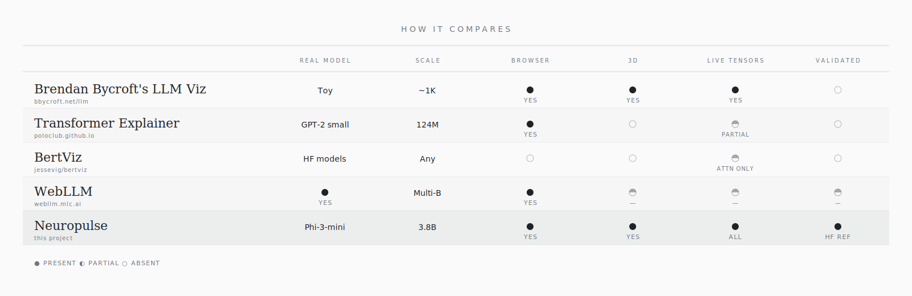
</picture>

</div>

<details>
<summary><sub>Same data as a plain-text table</sub></summary>

| | Real model | Scale | Browser | 3D | Live tensors | Validated |
|:---|:---:|:---:|:---:|:---:|:---:|:---:|
| [Brendan Bycroft's LLM Viz](https://bbycroft.net/llm) | Toy (sorts ABC) | ~1K | Yes | Yes | Yes | No |
| [Transformer Explainer](https://poloclub.github.io/transformer-explainer/) | GPT-2 small | 124M | Yes | No | Partial | No |
| [BertViz](https://github.com/jessevig/bertviz) | HF models | Any | No | No | Attn only | No |
| [WebLLM](https://webllm.mlc.ai/) | Yes | Multi-B | Yes | — | — | — |
| **Neuropulse** | **Phi-3-mini** | **3.8B** | **Yes** | **Yes** | **All** | **HF ref** |

</details>

<br>

## What you're actually watching

The 3D scene is not a metaphor. Each element maps to a named tensor in Phi-3-mini's compute graph.

<div align="center">

<picture>
  <source media="(prefers-color-scheme: dark)" srcset="public/scene-dark.svg">
  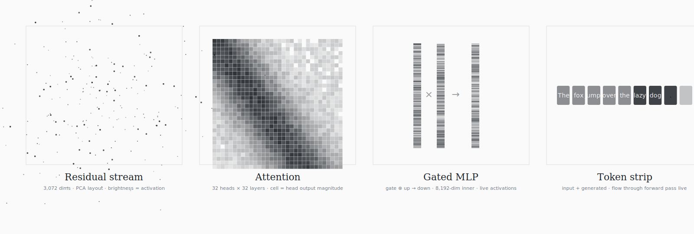
</picture>

</div>

The layout isn't arbitrary. Residual-stream positions come from PCA of the model's own layer-0 `qkv_proj` weight matrix — dimensions that get read into attention together cluster together. The geometry is shaped by the model, not by a designer.

<br>

## Architecture

<div align="center">

<picture>
  <source media="(prefers-color-scheme: dark)" srcset="public/architecture-dark.svg">
  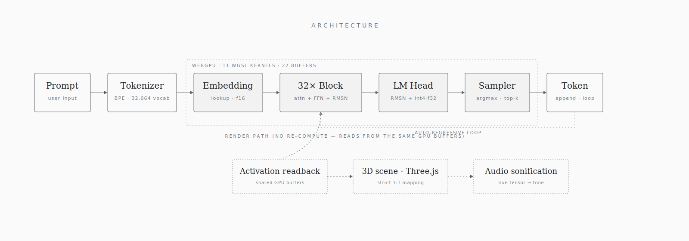
</picture>

</div>

Inference and visualization share the same GPU buffers. The renderer doesn't recompute anything — it reads the values the model already produced.

<br>

## Anatomy

Thirty-two transformer layers. The residual stream flows top-to-bottom; each row below is one named tensor in Phi-3-mini's compute graph.

<div align="center">

<picture>
  <source media="(prefers-color-scheme: dark)" srcset="public/layers-dark.svg">
  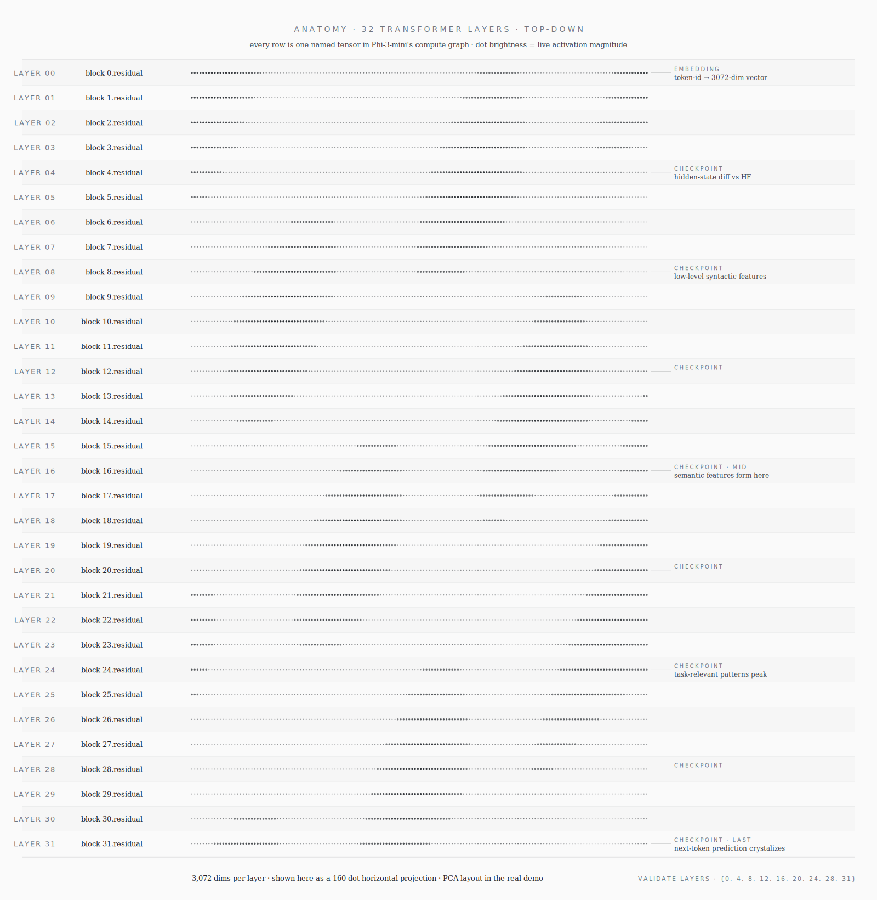
</picture>

</div>

The nine annotated rows are the parity checkpoints — `VALIDATE_LAYERS = {0, 4, 8, 12, 16, 20, 24, 28, 31}` in `src/engine/inference.ts`. Each checkpoint compares the live 3,072-dim residual against a pinned HuggingFace fp16 dump.

<br>

## Validation

"Strict 1:1" is a strong claim, so it has to be falsifiable. Neuropulse ships with a built-in test suite that diffs the WebGPU forward pass against a reference HuggingFace fp16 Phi-3-mini.

> [!TIP]
> Click the wrench icon in the demo. The numbers from **your** GPU print to **your** browser console in under a minute. No setup, no install — your machine is the test rig.

<div align="center">

<picture>
  <source media="(prefers-color-scheme: dark)" srcset="public/validation-dark.svg">
  
</picture>

</div>

Expected result: tiny deltas at hidden-state level (int4 quantization cost, not implementation drift) and identical top-1 tokens vs the fp16 reference. That last bit is the bar that matters.

A second layer runs in CI on every push ([`.github/workflows/check.yml`](.github/workflows/check.yml) → `npm run check`): it cross-checks documented claims (layer count, kernel count, dispatch counts, keyboard shortcuts) against the actual source, typechecks, and builds. If the README drifts from the code, CI fails. The numerical-parity suite above is deliberately **not** in CI — it needs the ~2 GB weights and a WebGPU device, which stock runners lack, so it runs in *your* browser on *your* GPU instead.

<br>

## The stack

Four pieces. No frameworks in the inference path. No dependency soup.

<div align="center">

<picture>
  <source media="(prefers-color-scheme: dark)" srcset="public/stack-dark.svg">
  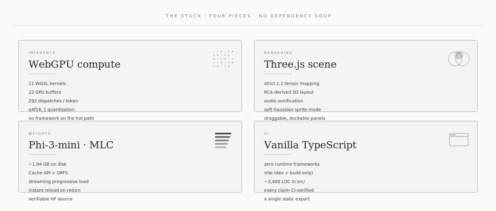
</picture>

</div>

<br>

### The 11 WGSL kernels

Every kernel has a job, an accumulator precision, and a declared error budget. They all run on the GPU you already own.

<div align="center">

<picture>
  <source media="(prefers-color-scheme: dark)" srcset="public/kernels-dark.svg">
  
</picture>

</div>

Numbers track [`METHODS.md`](METHODS.md) — the precision matrix and tolerances are the contract this project keeps.

<br>

## Inside the demo

Once the weights load, the demo is more than a single 3D view. Ten draggable panels, five view modes (one at a time), four overlays that stack on top of any view, and a keymap covering the whole interaction surface.

### Ten panels — every one a live tensor

<div align="center">

<picture>
  <source media="(prefers-color-scheme: dark)" srcset="public/panels-dark.svg">
  
</picture>

</div>

Every panel is screen-anchored, draggable, dockable as an orb in the bottom rail, and persists its position to `localStorage`. Press <kbd>P</kbd> or <kbd>Tab</kbd> to hide them all; <kbd>O</kbd> to collapse them into orbs.

<br>

### Controls and modes

<div align="center">

<picture>
  <source media="(prefers-color-scheme: dark)" srcset="public/controls-dark.svg">
  
</picture>

</div>

**Ablation** is the empirical-lab gate: zero out attention, FFN, or RoPE and watch the output collapse — proof that the circuit you turned off was actually doing something.

**Butterfly** is a transgenerational context-compaction demo. The built-in run walks a 5-message debugging transcript through `N_GENERATIONS = 3` "metamorphoses". Each generation:

1. A **tagger** call asks Phi-3 to label every message `keep / summarize / melt` with a 4–7-word reason.
2. A **chrysalis** call rebuilds the tagged transcript into a single coherent context at `TARGET_TOKENS = 400`.
3. Four hardcoded **noise messages** are injected for the next round.

After three metamorphoses, the same **needle question** (planted root-cause fact in message 4) is asked against two arms at the same token budget: (a) the butterfly's final rebuild, and (b) a recency-truncated `lastN` baseline. A separate **LLM-as-judge** Phi-3 call grades each answer **hit / partial / miss** against the expected fact.

Meanwhile the residual-stream slabs in the 3D scene get modulated by tag importance — `keep = 1.0`, `summarize = 0.55`, `melt = 0.12` brightness, with 30% intra-generation decay and 60% inter-generation decay — so you literally watch keep-tagged content stay bright across metamorphoses while melted content fades.

The transcript, question, and expected fact are all **editable** (the built-in JWT off-by-one story is just the default). Step-mode pauses between generations for inspection. If the ablation panel is active, the snapshot is **frozen at run-start** and passed to every tagger / chrysalis / answer call — the judge stays unablated so the rubric meter is stable across conditions.

**Kid mode** turns the model into its own narrator. All three are toggles, not separate tabs — switch on the fly during a single forward pass.

<br>

<details>
<summary><strong>Source tree</strong></summary>

```
src/
├── engine/
│   ├── shaders/               # WGSL compute kernels
│   │   ├── attention.wgsl         # multi-head attention
│   │   ├── attention_scores.wgsl  # QK^T / sqrt(d)
│   │   ├── rope.wgsl              # rotary position embeddings
│   │   ├── int4_matmul.wgsl       # quantized matrix multiply (f16 accum)
│   │   ├── int4_matmul_f32.wgsl   # quantized matrix multiply (f32 accum)
│   │   ├── fused_ffn.wgsl         # gated MLP (SiLU + gate + down)
│   │   ├── rms_norm.wgsl          # RMS layer normalization
│   │   ├── embedding.wgsl         # token embedding lookup
│   │   ├── kv_append.wgsl         # KV cache append
│   │   ├── add_norm.wgsl          # residual add + norm
│   │   └── argmax.wgsl            # greedy token selection
│   ├── compiler.ts            # pipeline compilation + buffer mgmt
│   ├── inference.ts           # forward pass orchestration
│   ├── tokenizer.ts           # BPE tokenizer (zero deps)
│   ├── weight-loader.ts       # Cache API streaming + progress
│   └── activation-reducer.ts  # tensor readback for visualization
├── visualizer.ts              # Three.js — strict 1:1 tensor rendering
├── audio.ts                   # sonification of live tensor data
└── main.ts                    # app shell + UI + interaction
```

</details>

<br>

## Experiments — the Butterfly investigation

> **Butterfly has moved to its own repo and DOI: [github.com/abgnydn/butterfly](https://github.com/abgnydn/butterfly).**
> The compaction harness, the trained taggers, the sweep scripts, and the full
> writeup ([`PAPER.md`](https://github.com/abgnydn/butterfly/blob/main/PAPER.md))
> now live there. Neuropulse keeps only the in-app demo
> (`src/butterfly-mode.ts`) and the git-timestamped pre-registrations
> ([`PREDICTIONS.md`](PREDICTIONS.md)). This repo no longer ships the
> `tools/butterfly-*.mjs` scripts — all reproduce commands are in the butterfly
> repo.

Butterfly started as one of the demo overlays and became a pre-registered probe
of a context-compaction mechanism. The question: *at a fixed token budget, does
tag-and-rebuild preserve load-bearing information better than naive `lastN`
truncation?* After several rounds of self-refutation, the honest answer:

- **The mechanism is real on modest haystacks.** A 14-parameter softmax
  classifier trained on ~11K `has_answer`-labeled turns delivers ~38% downstream
  QA accuracy vs lastN's ~15% on LongMemEval-oracle — a ~2.5× lift on the metric
  that matters (LLM-judged answer correctness, not substring preservation).
  Inter-judge agreement 87–93%, so the ranking isn't a same-model artifact.
- **It replicates on independent data.** The regex tagger and its learned
  descendants beat lastN on evidence-turn preservation across all three
  LongMemEval splits — oracle (~6.6K tok), _s (~121K tok), _m (~1.25M tok) —
  a consistent direction over three orders of magnitude of context size.
- **It is domain-locked.** A classifier trained on LongMemEval preserves 0% of
  the needle on engineering-chat transcripts (where evidence is
  identifier-shaped), and the reverse holds too. There is no universal butterfly:
  production means one classifier per deployment domain.

What this does **not** claim: not a long-term memory system (it fails on large
multi-session haystacks where retrieval, not compaction, is the bottleneck);
not a validation of the multi-generation chrysalis loop downstream (the QA eval
was single-pass); not a comparison against real production baselines
(mem0 / Letta / vector-retrieval + LLM-summary were not benchmarked); not a
substitute for a frontier model's `/compact`. The two pre-registered predictions
([P-20260512-05](PREDICTIONS.md) — refuted; [P-20260515-06](PREDICTIONS.md) —
confirmed) and the full post-mortem with self-critique live in the
[butterfly repo](https://github.com/abgnydn/butterfly).

<br>

## Run locally

<div align="center">

<picture>
  <source media="(prefers-color-scheme: dark)" srcset="public/runlocal-dark.svg">
  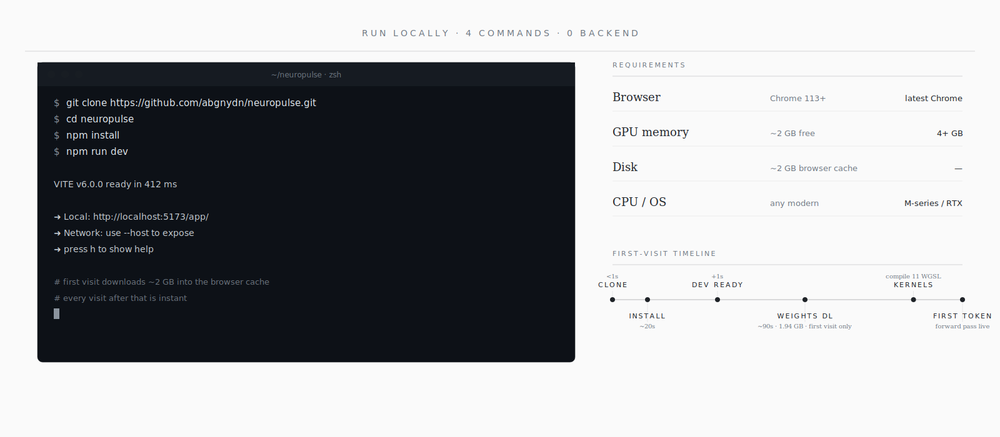
</picture>

</div>

```bash
git clone https://github.com/abgnydn/neuropulse.git
cd neuropulse
npm install
npm run dev
```

Open **http://localhost:5173/app/** in Chrome, Edge, or Safari Technology Preview. First visit downloads ~2 GB into the browser cache; every visit after that is instant.

> [!IMPORTANT]
> WebGPU is required. Firefox does not ship WebGPU on stable yet; use Chrome, Edge, or Safari Technology Preview.

<br>

## Acknowledgments

- **[Microsoft Phi-3-mini](https://huggingface.co/microsoft/Phi-3-mini-4k-instruct)** — the model under the glass.
- **[MLC](https://mlc.ai/)** — q4f16_1 weight format and the WebGPU inference patterns this project builds on.
- **[Three.js](https://threejs.org/)** — the renderer.
- **[Brendan Bycroft's LLM Viz](https://bbycroft.net/llm)** — proved a transformer could be *seen*. This project asks: can it be seen at scale?

<br>

## Cite

```bibtex
@software{gunaydin_neuropulse_2026,
  author  = {Günaydın, Ahmet Barış},
  title   = {Neuropulse: Real-Time 1:1 Visualization of a Full-Scale LLM
             Forward Pass in the Browser},
  year    = {2026},
  doi     = {10.5281/zenodo.20505470},
  url     = {https://doi.org/10.5281/zenodo.20505470}
}
```

DOI: [10.5281/zenodo.20505470](https://doi.org/10.5281/zenodo.20505470) (concept — resolves to the latest version).

<br>

## License

[MIT](LICENSE) — do whatever you want, just keep the copyright notice.

<br>

<div align="center">

<picture>
  <source media="(prefers-color-scheme: dark)" srcset="public/monogram-dark.svg">
  
</picture>

<sub>Built by <a href="https://github.com/abgnydn">Ahmet Barış Günaydın</a></sub>

</div>
